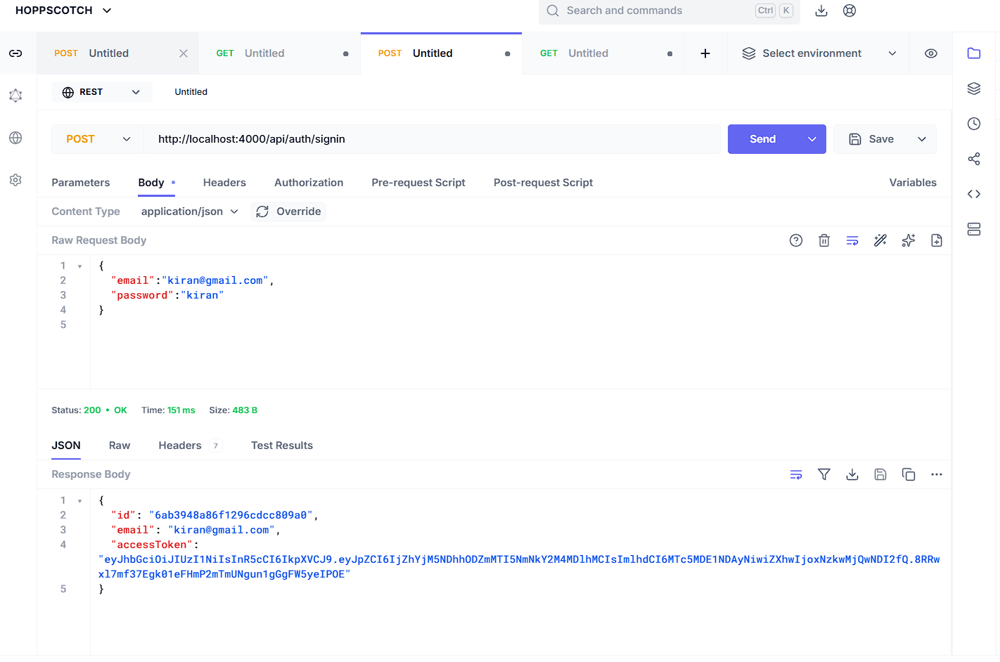
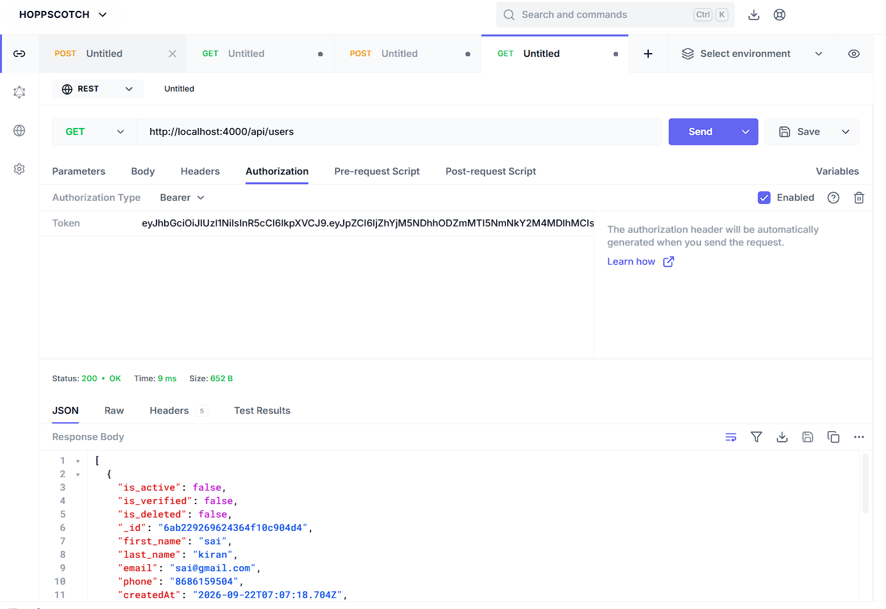

## NodeJsExpressApi
To create APIs using Node, Express and MongoDB.

### `mongod`
This command will start your mongodb server on your machine. If you have not start the mongodb on
your then you will get database connection error when run node server.

 In the project directory, you can run:

### `npm install`

This will install the dependencies inside `node_modules`

### `node server.js` OR `nodemon start`

Runs the app in the development mode. 
Open [http://localhost:4000](http://localhost:4000) to view it in the browser.

To use it: 
1. POST /api/auth/signup to register.
2. POST /api/auth/signin to get an accessToken, 
3. Then send Authorization: Bearer <token> on all /api/users/* requests.

Use Hoppscotch / postman app and perform CRUD operations.

Use token to fetch details
