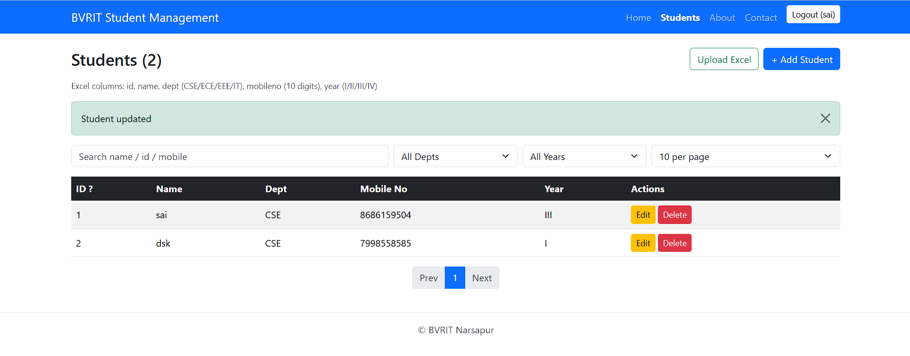

# Student Management System (BVRIT Narsapur)

React (Vite) frontend + Express backend + MongoDB.

## Features
- Pages: Home, Register, Login, Students, About, Contact (React Router)
- JWT-based register/login; Students page is protected
- Student CRUD (id, name, dept: CSE/ECE/EEE/IT, mobileno: 10 digits, year: I/II/III/IV)
- Bulk upload from Excel (.xlsx/.xls/.csv)
- Server-side pagination, sorting, search and dept/year filters
- Bootstrap UI

## Prerequisites
- Node.js 18+
- MongoDB running locally (default `mongodb://127.0.0.1:27017`)

## Setup & Run

Backend:
```
cd express
npm install
npm start
```
Configure `express/.env`:
```
MONGO_URI=mongodb://127.0.0.1:27017/student_management
JWT_SECRET=change-me
PORT=5000
```

Frontend:
```
cd react
npm install
npm run dev
```
Open http://localhost:5173. To use a different API URL, set `VITE_API_URL` (default `http://localhost:5000/api`).

## Excel format
First sheet, header row with these columns:

| id | name | dept | mobileno | year |
|----|------|------|----------|------|
| S101 | Asha | CSE | 9876543210 | II |

Invalid rows and duplicate IDs are skipped and reported after upload.

## API (all `/api/students*` routes need `Authorization: Bearer <token>`)
| Method | Route | Description |
|---|---|---|
| POST | `/api/auth/register` | Register user |
| POST | `/api/auth/login` | Login, returns token |
| GET | `/api/students` | List; query: `page, limit, sortBy, order, search, dept, year` |
| POST | `/api/students` | Add student |
| PUT | `/api/students/:id` | Update student |
| DELETE | `/api/students/:id` | Delete student |
| POST | `/api/students/upload` | Bulk upload (multipart field `file`) |

## Output

